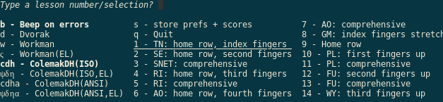

# Workmanship: configurable typing tutor for keyboard layouts


A curses terminal app to practice typing for various keyboard layouts.

Totally ALPHA, decent training texts only for *dvorak*,
[*workman* layout](https://workmanlayout.org/) was translated from it.

## Usage

Install (prefferably in a *venv*) and launch it like this:

```bash
pip install workmanship
workmanship
```


### Data for layout lessons

Words & ngrams for the keyboard layouts are in `src/workmanship/lessons.yml` file.
The original *dvorak* lessons were extracted with `$ strings dvorak7min`
and were translated into *workman* layout by mapping the relocated keys between
these 2 layouts (see `bin/convert_lessons_across_layouts.py`) - hence
the gibberish ngrams & words in this layout.

As of v0.2.0, these layouts have been defined

- dvorak
- workman
- workman(el) - Greek letters
 
## History 

Data and idea based on [dvorak7min](https://github.com/yaychris/dvorak7min)
by Dan Wood <danwood@karelia.com>, available in the [original html format](http://www.karelia.com/abcd/).

What started as a search for a personal training tutorial on *workman* layout,
ended up as a python *curses* excersize for multiple layouts with score statistics.

But it is, and will remain, an excersize in futility,
given the plethora of online typing tutors and games.

## Similar apps and sites

- Blogpost for [a tkinter tutor](https://hackernoon.com/make-your-own-typing-tutor-app-using-python-6i19734se).
- Excellent site for [training at various layouts & styles](https://www.keybr.com/).
- A [site with speed-tests](https://thetypingcat.com/typing-speed-test) for all layouts.
- [typing.io](https://typing.io/): code snippets for various languages.
- ...too many to count (but very few for *workman* layout).
